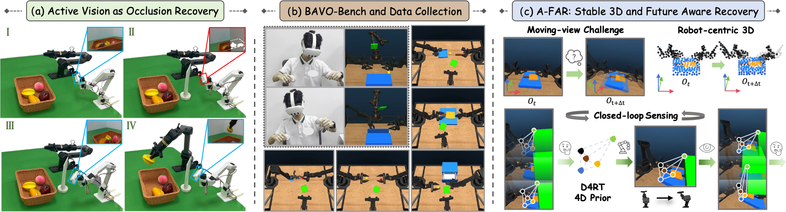
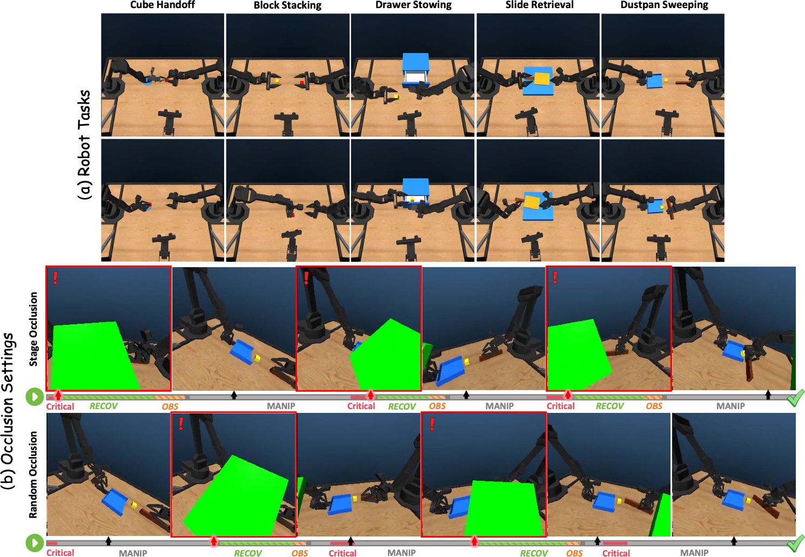

<h1 align="center">Recovering the View: Benchmarking Physical Active Vision for Occlusion Recovery in Robotic Manipulation</h1>

<p align="center">
  <a href="https://hcplab-sysu.github.io/BAVO-Bench/">
    
  </a>
  <a href="https://arxiv.org/abs/2609.37292">
    
  </a>
</p>

<p align="center">
  
</p>

**Overview of our motivation, benchmark, and approach.** **(a)** We study physical active vision as closed-loop recovery from external occlusion: using a single active camera as the sole visual sensor, the robot actively changes its viewpoint to recover task-relevant visibility and continue manipulation. **(b)** We introduce **BAVO-Bench**, a bimanual active-vision manipulation benchmark that systematically introduces controlled external occlusions to study viewpoint recovery, together with a VR teleoperation pipeline for collecting active-view demonstrations. **(c)** We present **A-FAR**, an active-vision policy that canonicalizes moving-view observations in robot-centric 3D and distills D4RT's 4D relational priors, enabling stable, future-aware control under active viewpoint changes.

<p align="center">
  
</p>

**BAVO-Bench overview.** **Top:** Five multi-stage bimanual manipulation tasks. **Bottom:** Representative rollouts under the two occlusion settings. Red-bordered frames mark occlusion events, and the timelines illustrate recovery and manipulation behaviors. Both settings occlude task-relevant targets; **Stage Occlusion** aligns interventions with predefined task transitions, whereas **Random-time Occlusion** samples intervention times independently of these transitions.

## Project Roadmap

- [x] Publish the paper and project page.
- [ ] Release the BAVO-Bench dataset.
- [ ] Release the BAVO-Bench code.

## Citation

```bibtex
@misc{luo2026recoveringviewbenchmarkingphysical,
  title={Recovering the View: Benchmarking Physical Active Vision for Occlusion Recovery in Robotic Manipulation},
  author={Kaijun Luo and Yudi Huang and Qijun Zhong and Xinshuai Song and Yang Liu and Liang Lin},
  year={2026},
  eprint={2609.37292},
  archivePrefix={arXiv},
  primaryClass={cs.RO},
  url={https://arxiv.org/abs/2609.37292},
}
```
